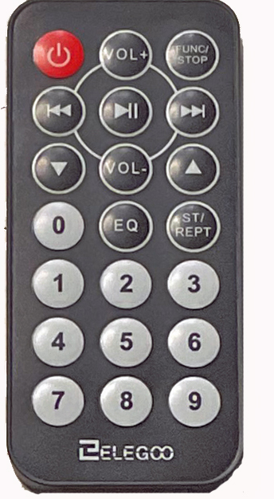

## Getting Started

* Download [Arduino Desktop IDE](https://www.arduino.cc/en/Guide)

* Install necessary libraries
  * IRremote
  * LiquidCrystal_I2C
  * DS1307RTC
  
* Clone this repository into the Arduino directory

## Introduction

### Hardware
The PLC Mega 328 is a kit from Canaduino requiring soldering . Assembly instructions can be found [here](https://universal-solder.ca/downloads/CANADUINO_DIY_PLC_MEGA328_100-12_Assembling.pdf).

The PLC Mega 328 uses the Arduino Nano microcontroller and DS1327 Real Time Clock as well as the Infra Red Receiver, and a 16x2 LCD display.

There are 4 opto-isolated digital inputs, operating on an input voltage of 3V to 12V DC. The 6 digital outputs use the OMRON G5NB-1A-E relay which has a 10ms operate and release time, and 5A contacts.

Analog inputs and outputs are 0-10V.

Analog outputs are short circuit protected by limiting the maximum output current.

Analog inputs are protected against over voltage of max. 28V.

The NANO’s I2C bus is used to connect to the on-board RTC and it can also be accessed through the 4-pin female header besides the analog inputs section.

Since there are necessary pull-up resistors for the RTC chip already on board, the external IR Receiver that uses the I2C bus is connected without additional pullup resistors. The supply voltage for the PLC is 12V DC with a maximum current drawn of less than 500mA. Screw terminals fit wires 22-14 AWG (1.5mm max.) 

### PLC / Infra Red Remote System

The PLC/Infra Red (IR) Remote System consists of the PLCMega 328, an I2C LC1602 display, an IR Receiver module with and I2C bus interface, an external 5 VDC power supply for the IR Receiver (the 5 VDC could be supplied by the PLC), and an IR Remote. The choice of the IR Remote will dictate the coding of the IR Receive function.

### Purpose of the Project and Documentation
The project could be adapted for a variety of academic lab experiences such as electrical, computer, and mechatronic engineering, as well as computer technician/technology training. The intent of the project is to develop the following skills:
* C Programming
* Industrial automation
* Process Control
* Microcontroller applications
* Assembly/soldering

The labs could be organized to include/exclude the following:
1. Assemble the PLC
2. Develop Boolean code functions
3. Develop On Delay Timer Function
4. Develop Off Delay Timer Function
5. Develop Sequencer
6. Develop an industrial automation operation such as a pick and place robot
7. Develop and/or use the PID and internal Simulator
8. Develop a control operation using the PID controller
9. Develop LCD Interface
10. Develop IR Interface

### Software
The code is written in C and developed on the Arduino Integrated Develeopment Environment (IDE). The block diagram on the next page offers a simplified description of the organization of the code.

The intent was to create functions that implement in a similar manner, the ladder logic tools used on PLCs in the field of Industrial Automation. The following functions were developed:

* Boolean functions AND, OR, and XOR (exclusive Or).
* On Delay Timer
* Off Delay Timer
* Up Counter
* Down Counter
* Sequencer
* PID Controller

The PID controller output, controlled variable and set point are normalized 0 to 1.0. Inputting /Outputing will require mapping the normalized variables to the analog input/outputs.
Two first order lag simulator functions are included to experiment with the PID Controller. The lags can be cascaded to simulate a second order system. The simulator process variables are nomalized 0 to 1.0.

The infra red (IR) receiver function allows interaction in real time with the On Delay timer, Off Delay timer, sequencer, and analog output. The IR receiver also allows starting and stopping scanning.

Timing settings are displayed on the LCD1602. In addition, the On and Off delay timers can start and reset the timers via the IR remote.

  * **Red Power Button** – tuns Scan On/Off
  * **FUNC STOP** On Delay Start/Stop
  * **Vol+** On Delay Increase Seconds
  * **Vol-** On Delay Decrease Seconds
  * **^** On Delay Increase Minutes
  * **V** On Delay Decrease Minutes
  * **ST/RPT** Off Delay Start/Stop
  * **|>|>|** Off Delay Increase Seconds
  * **|<|<|** Off Delay Decrease Seconds
  * **|>||** Off Delay Increase Minutes
  * **EQ** Off Delay Decrease Minutes
  * **0** Analog Out Count Increase
  * **9** Analog Out Count Decrease 

The settings for all the functions can be set directly in the code rather than using the IR Remote. However, the IR Remote allows the settings to be changed at run time. As a DS1307 real time clock is used for timing, the On and Off Delay timer implementation does not require the delay (ms) function. That is the scan operates without delay. The On and Off Delay Timers can be set from 1 sec to 59 minutes and 59 seconds. If the PID controller is used there will be a necessary 20 msec delay due to the integration and differentiation required when implementing PID.

